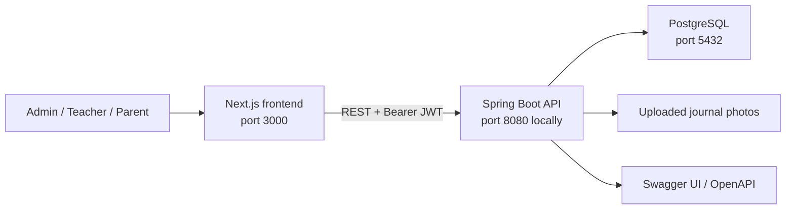

# Kindergarten Management Platform

A full-stack web application for managing the day-to-day work of a kindergarten. It gives administrators, teachers, and parents role-specific workspaces for organizing groups, tracking attendance, and sharing children's daily activities.

The project is currently an MVP built around a single default kindergarten. It demonstrates a complete client-server application with JWT authentication, role-based access control, persistent PostgreSQL data, file uploads, database migrations, and containerized deployment.

## Features

### Kindergarten administrator

- Dashboard with totals for children, groups, and teachers
- Attendance overview with present, absent, and sick statistics
- Create, edit, list, and remove teachers
- Create, edit, list, and remove groups
- Assign one active teacher to a group
- View children, inspect parent relationships, and assign unassigned children to groups

### Teacher

- Dashboard with group information and recent activity
- View class records and children assigned to the teacher's group
- Record and manage attendance by date and status
- Create and edit daily journal entries
- Add summaries, milestones, and photos to journal entries
- Keep private browser-local notes on the dashboard

### Parent

- Self-register and sign in to a dedicated parent workspace
- Add and update children linked to the parent account
- View child information and group assignments
- Read journal entries shared by the child's teacher
- Follow recent journal activity from the dashboard

### Platform capabilities

- Stateless JWT authentication with a 24-hour token lifetime
- Role-based UI routing and backend authorization
- Server-side validation and centralized API error responses
- Pagination and filtering for management views
- Image upload validation for PNG, JPEG, and WebP files up to 5 MB
- Interactive OpenAPI/Swagger documentation
- Versioned PostgreSQL schema migrations with Flyway
- Responsive interface built with Material UI

## Tech stack

| Area | Technologies |
| --- | --- |
| Frontend | Next.js 16, React 19, TypeScript 5 |
| UI | Material UI 7, Emotion, Tailwind CSS 4, Framer Motion |
| Forms and validation | React Hook Form, Zod |
| Data and visualization | TanStack Query, Recharts, date-fns, Day.js |
| Backend | Java 25, Spring Boot 4, Spring MVC, Spring Security |
| Persistence | PostgreSQL, Spring Data JPA, Hibernate, Flyway |
| API and mapping | REST, springdoc-openapi, MapStruct, Lombok |
| Authentication | JWT with JJWT, BCrypt password hashing |
| Testing | JUnit 5, Spring Boot Test, Spring Security Test |
| Infrastructure | Docker, Docker Compose, GitHub Actions |

## Architecture



The frontend uses the Next.js App Router and separates pages by user role. Shared UI primitives live in `frontend/src/components`, while domain-specific API clients, models, hooks, and screens are organized under `frontend/src/modules`.

The backend follows a modular controller-service-repository structure. Tenant-aware domain data is stored in PostgreSQL, Spring Security validates JWTs on protected endpoints, and Flyway applies schema changes when the application starts.

## Repository structure

```text
.
├── backend/                    # Spring Boot REST API
│   ├── src/main/java/          # Security, domain modules, controllers and services
│   ├── src/main/resources/     # Runtime configuration and Flyway migrations
│   └── src/test/               # Backend tests
├── frontend/                   # Next.js web application
│   ├── public/                 # Static assets
│   └── src/
│       ├── app/                # App Router layouts and role-based pages
│       ├── components/         # Shared UI and feature components
│       ├── context/            # Authentication and application state
│       ├── modules/            # Domain models, API clients, hooks, and UI
│       └── services/           # Shared API and authentication services
├── .github/workflows/          # CI/CD deployment workflow
├── docker-compose.dev.yml      # Local PostgreSQL service
└── docker-compose.yml          # Production service composition
```

## Getting started locally

### Prerequisites

- Java 25
- Node.js 20 or newer and npm
- Docker with Docker Compose

Gradle does not need to be installed globally; the repository includes the Gradle Wrapper.

### 1. Start PostgreSQL

From the repository root:

```bash
docker compose -f docker-compose.dev.yml up -d postgres
```

The development database is available on `localhost:5432` with these defaults:

| Setting | Value |
| --- | --- |
| Database | `kindergarten` |
| Username | `postgres` |
| Password | `postgres` |

### 2. Configure and run the backend

Create `backend/src/main/resources/.env.properties`:

```properties
SPRING_DATASOURCE_URL=jdbc:postgresql://localhost:5432/kindergarten
SPRING_DATASOURCE_USERNAME=postgres
SPRING_DATASOURCE_PASSWORD=postgres
JWT_SECRET=replace-this-with-a-random-secret-at-least-32-characters-long
STORAGE_UPLOAD_PATH=uploads
```

Then start Spring Boot:

```bash
cd backend
./gradlew bootRun
```

On Windows PowerShell, use `./gradlew.bat bootRun` instead. The API starts at [http://localhost:8080](http://localhost:8080), and Flyway creates or updates the database schema automatically.

### 3. Configure and run the frontend

Create `frontend/.env.local`:

```dotenv
NEXT_PUBLIC_API_URL=http://localhost:8080
```

Install dependencies and start the development server:

```bash
cd frontend
npm ci
npm run dev
```

Open [http://localhost:3000](http://localhost:3000).

Public registration creates a user with the `PARENT` role. Teacher and kindergarten administrator accounts are managed separately and are not created by the public registration form.

### Stop the development database

```bash
docker compose -f docker-compose.dev.yml down
```

Add `-v` only when you intentionally want to delete the local PostgreSQL volume and all development data.

## API documentation

With the backend running, open:

- Swagger UI: [http://localhost:8080/swagger-ui/index.html](http://localhost:8080/swagger-ui/index.html)
- OpenAPI JSON: [http://localhost:8080/v3/api-docs](http://localhost:8080/v3/api-docs)

Most endpoints require an `Authorization: Bearer <token>` header. Obtain a token through `POST /auth/login`, then use Swagger UI's **Authorize** action or pass the header from an API client.

The main API areas are authentication, users, children, groups, attendance, teacher journals, parent journals, tenants, and photo uploads.

## Configuration reference

| Variable | Used by | Purpose |
| --- | --- | --- |
| `SPRING_DATASOURCE_URL` | Backend | PostgreSQL JDBC connection URL |
| `SPRING_DATASOURCE_USERNAME` | Backend | Database username |
| `SPRING_DATASOURCE_PASSWORD` | Backend | Database password |
| `JWT_SECRET` | Backend | Secret used to sign JWTs; use at least 32 characters |
| `STORAGE_UPLOAD_PATH` | Backend | Directory where uploaded journal photos are stored |
| `NEXT_PUBLIC_API_URL` | Frontend | Public base URL of the backend API |

Do not commit real credentials or production secrets. `NEXT_PUBLIC_API_URL` is embedded into the frontend build and must be supplied when the Docker image is built.

## Development commands

### Frontend

```bash
cd frontend
npm run dev       # development server
npm run lint      # ESLint checks
npm run build     # optimized production build
npm run start     # run the production build
```

### Backend

```bash
cd backend
./gradlew test     # run the test suite
./gradlew build    # test and build the executable JAR
./gradlew bootRun  # run the API locally
```

Use `gradlew.bat` for these commands on Windows.

## Docker and deployment

Both applications include production Dockerfiles. The root `docker-compose.yml` is intended for deployment with prebuilt backend and frontend images from Docker Hub; it is not the local source-build workflow.

The GitHub Actions workflow on `main`:

1. builds the backend JAR and both Docker images;
2. pushes the images to Docker Hub;
3. copies the production Compose file to the target server;
4. pulls and restarts the services over SSH.

Deployment requires the Docker Hub, SSH, database, JWT, storage, and public API URL secrets referenced in `.github/workflows/deploy.yml`.

## Current scope

- The application currently seeds and uses one default tenant for the MVP. Full tenant onboarding is not implemented yet.
- Public self-registration is limited to parents.
- Uploaded files are stored on the backend filesystem rather than object storage.
- The repository does not currently provide seeded demo users; role-specific accounts must be created through the relevant management flow or database setup.
